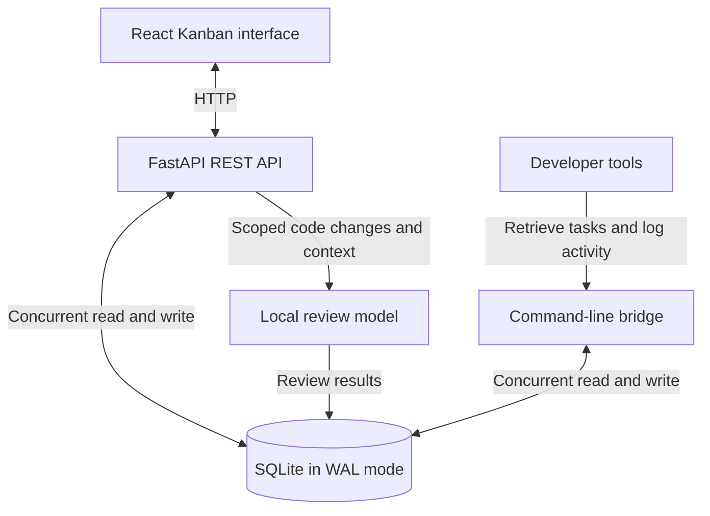

# Alexis Bailon

**Software Engineer | Backend Integrations | Workflow Automation | Full-Stack Development**

Software engineer with 7+ years of experience building integrations, workflow automations, internal tools, and applications that solve real business problems.

My work spans backend architecture, REST APIs, database-driven workflows, real-time data synchronization, full-stack web development, and native Android applications. I focus on building maintainable systems from initial requirements through implementation, deployment, and production support.

I also have experience with AI-assisted development tools for research, scaffolding, debugging, documentation, and code review, with final architecture and implementation decisions verified manually.

---

## Featured Production & Systems Architecture

### Live Production Ordering Platform (Food Truck Ecosystem)
`[Private Project / Closed Source]` • `[Live in Production]` • `[Progressive Web App]`
- Designed and deployed a multi-role ordering platform for real-time coordination between front-of-house staff, kitchen staff, and administrators. 
**Technology:** React 19, Vite, Tailwind CSS, Firebase Realtime Database, Firebase Authentication, and the Web Audio API.

**Engineering highlights:**

- Real-time order synchronization across multiple devices
- Front-of-house tablet ordering interface
- mobile device optimized Kitchen Display System
- Audio notifications for incoming kitchen orders
- Role-based application behavior and access
- Administrative order and system controls
- Project-level engineering guidelines and technical documentation

### Workflow Management System
`[Systems Architecture]` • `[FastAPI / React 19]` • `[Local LLM Orchestration]`
Built a self-hosted Kanban and development-workflow system for coordinating work across multiple software repositories.

**Technology:** Python, FastAPI, React, Vite, SQLAlchemy, and SQLite in Write-Ahead Logging mode.

**Engineering highlights:**

- REST API for projects, tickets, status updates, and audit history
- React-based Kanban interface
- Shared SQLAlchemy models across the API and command-line tools
- Command-line bridge for controlled task retrieval and activity logging
- Concurrent database access using SQLite Write-Ahead Logging
- Repository-specific ticket and planning context
- Local code-review workflow for analyzing scoped Git changes
- Integration with local language models for private, offline review assistance

---

## Open Source & Active Applications

### E85 Fuel & Technical Utility Application
`[Open Source]` • `[Native Android]` • `[Kotlin / Jetpack Compose]`
Developed a native Android application that calculates the quantities of gasoline and E85 required to reach a target ethanol mixture.

**Technology:** Kotlin, Jetpack Compose, Material 3, and Android SharedPreferences.

**Engineering highlights:**

- Pure, stateless fuel-calculation engine
- Separation between calculation logic and the Compose interface
- Real-time input validation
- Persistent user preferences
- Height-adaptive layouts
- Custom Material 3 interface components
- Migration from an earlier .NET MAUI implementation to native Android
- 
* **[Explore the Codebase ➔](https://github.com/alexisbailon1/e85-calculator)**
* **[Download the latest APK release here ➔](https://github.com/alexisbailon1/e85-calculator/releases/latest)**

### Pokémon TCG Scanner & Valuation Tracker
`[Active Development / Closed Source]` • `[Computer Vision / On-Device ML]` • `[Offline-First Android]`
Developing an Android application for cataloging Pokémon trading cards through camera capture, card identification, collection tracking, and valuation history.

**Technology:** Kotlin, Jetpack Compose, Room, CameraX, OpenCV, ML Kit, TCGdex API, and Vico charts.

**Current development areas:**

- Camera-based card capture
- Card-boundary detection and perspective correction
- OCR-assisted card-name, set-code, and card-number extraction
- Offline collection storage with Room
- Perceptual-hash matching for duplicate detection
- Sealed-product purchase and opening-session tracking
- Collection value and return-on-investment charts
- Evaluation of custom on-device vision models for card recognition
  
---

## Technical Skills

### Languages and Backend

PHP, JavaScript, Python, Kotlin, SQL, C#, FastAPI, SQLAlchemy, REST APIs, and webhooks

### Frontend and Mobile

React, Vite, Tailwind CSS, Android, Jetpack Compose, Material 3, Progressive Web Apps, and .NET MAUI

### Databases and Platforms

Microsoft SQL Server, SQLite, Room, Firebase Realtime Database, Firebase Authentication, Git, GitHub, Jira, Tray.io, and Zapier

### Computer Vision and Device APIs

CameraX, OpenCV, ML Kit OCR, perceptual hashing, perspective correction, and the Web Audio API

### Development Practices

Requirements analysis, API integration, technical documentation, debugging, production support, code review, workflow automation, and AI-assisted development with manual verification
