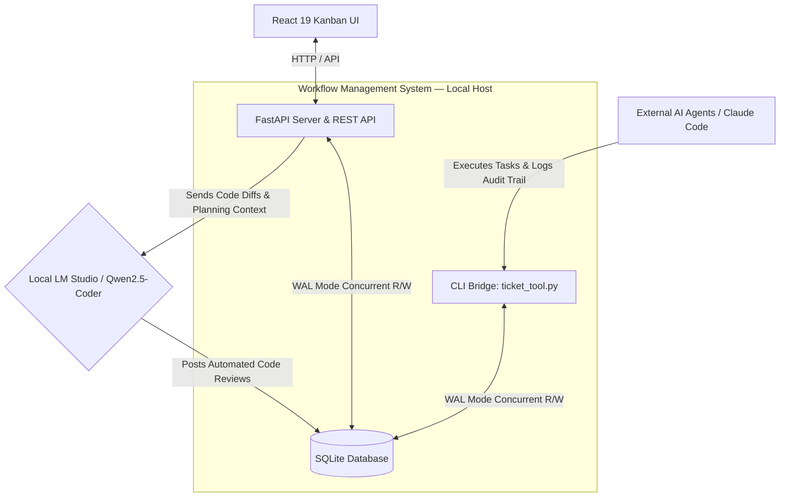

# Hi there, I'm a Software Engineer 👋

I have 7+ years of experience building integrations, automations, and internal tools that solve real business problems. I specialize in backend architecture, real-time data synchronization, and accelerating full-stack product development through **AI-assisted tooling, local LLM orchestration, and autonomous agent workflows**.

Here is a look at what I build, how I ship to production, and the systems I engineer from concept to deployment.

---

## 🚀 Featured Production & Systems Architecture

### 🌮 Live Production Ordering Platform (Food Truck Ecosystem)
`[Proprietary / Closed Source]` • `[Live in Production]` • `[Progressive Web App]`
Architected and deployed a commercial-grade, multi-role Progressive Web App engineered for real-time order synchronization across front-of-house tablets, an iOS-optimized Kitchen Display System (KDS) with Web Audio alerts, and an administrative control panel. Built with **React 19, Vite, Tailwind CSS v4, and Firebase Realtime Database**.
* **AI Engineering Workflow:** Leveraged Claude Code as an architectural pair-programmer utilizing strict agent operating rules (`AGENTS.md`), task-tracked iteration, and living technical documentation (`DOCUMENTATION.md`) to rapidly scaffold complex item-customization routing and zero-latency database hooks without technical drift.

### 🤖 Workflow Management System
`[Systems Architecture]` • `[FastAPI / React 19]` • `[Local LLM Orchestration]`
Engineered a self-hosted, local-first Kanban hub designed to coordinate software development across multiple repositories between human developers and autonomous AI agents. Built with a **FastAPI REST backend, React/Vite UI, and SQLite running in WAL (Write-Ahead Logging) mode**.
* **Agentic CLI Bridge:** Developed a custom command-line bridge (`ticket_tool.py`) allowing external AI agents (like Claude Code) to concurrently fetch task queues, read full ticket context, and log audit comments directly against the shared database without lock contention, shell exposure, or API key leaks.
* **Local LLM Code Review:** Integrated a private, one-click code review loop that scopes git diffs and project planning docs to a ticket's target path, sending them to a local **Qwen2.5-Coder model running in LM Studio** for immediate architectural feedback.

---

## 💻 Open Source & Active Applications

### ⛽ E85 Fuel & Technical Utility Application
`[Open Source]` • `[Native Android]` • `[Kotlin / Jetpack Compose]`
Developed a native Android utility application engineered with a single-activity Composable architecture and a pure, stateless calculation core (`FuelCalculator`). Solves complex splash-blending algebra on the fly to help automotive enthusiasts hit target ethanol blends with real-time input validation and persistent state.
* **Engineering Focus:** Demonstrates clean MVVM separation, custom Material 3 interactive UI elements, unit-testable algorithmic logic, and height-adaptive layouts.
* **AI Prototyping:** Built via an iterative AI pair-programming loop for initial mathematical scaffolding and bug triage, paired with rigorous on-device validation.
* **[Explore the Codebase ➔](https://github.com/alexisbailon1/e85-calculator)**

### 🃏 Pokémon TCG Scanner & Valuation Tracker
`[Work In Progress]` • `[Computer Vision / OCR]` • `[Offline-First Android]`
An offline-first Android cataloging tool that transforms a device camera into an automated card ingestion and financial valuation pipeline. Built with **Kotlin, Jetpack Compose, Room SQLite, and the TCGdex API**.
* **Computer Vision Pipeline:** Integrates CameraX with native **OpenCV** (Otsu-adaptive Canny edge detection and perspective warping) to standardize angled card photos, **ML Kit Text Recognition** for on-device set/number OCR, and **64-bit perceptual hashing (pHash)** with Hamming-distance matching for instant deduplication.
* **Collector Accounting:** Features sealed "Rip Session" tracking that decouples purchase prices from pulled card valuations, rendering live ROI and valuation charts via Vico.
* **[Follow Active Development ➔](https://github.com/alexisbailon1/pokemon-tcg-tracker)**

---

## 🛠️ Technical Arsenal
* **Languages & Backend:** PHP, JavaScript, Kotlin, Python, SQL, Microsoft SQL Server, FastAPI, SQLAlchemy, RESTful APIs.
* **Frontend & Mobile:** React 19, Vite, Tailwind CSS v4, Android (Native), Jetpack Compose, Material 3, Progressive Web Apps (PWA).
* **Database & Integrations:** SQLite (WAL Mode), Firebase Realtime Database & Auth, Room SQLite, Zapier, Tray.io, Atlassian Jira, Git/GitHub.
* **AI & Agentic Systems:** Claude Code (CLI / Headless), Gemini, Local LLM Orchestration (LM Studio, Qwen2.5-Coder, Gemma, Llama), Custom CLI Agent Bridges, Automated Scaffolding & Code Review.
* **Systems & Vision Architecture:** OpenCV (Adaptive Edge Detection / Perspective Warping), ML Kit OCR, CameraX, Perceptual Hashing (pHash), Web Audio API.
